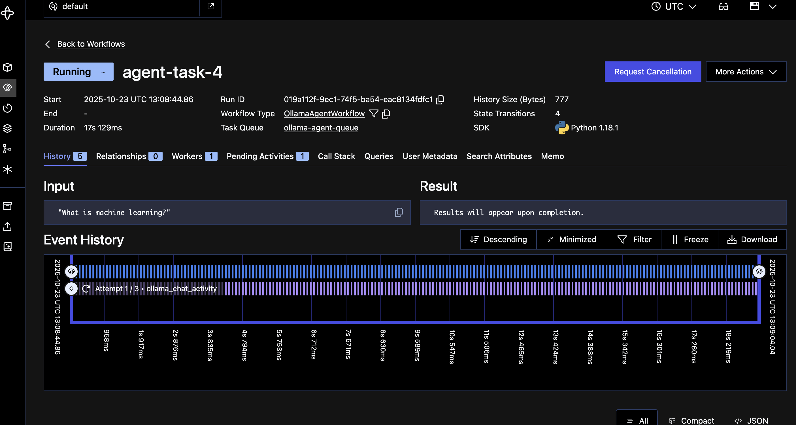
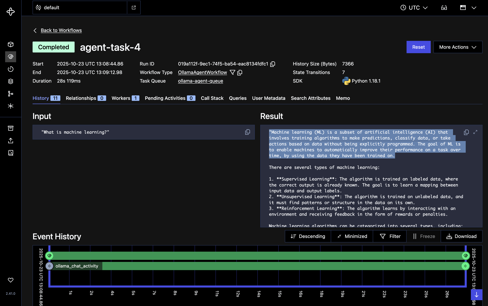
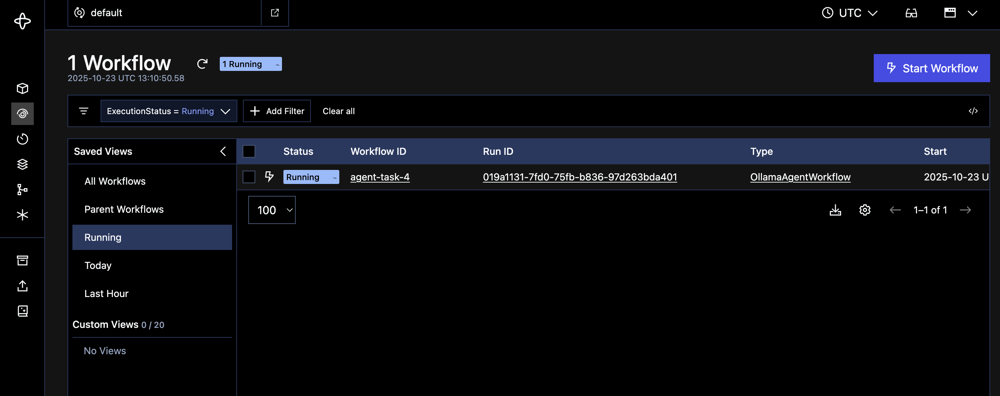

# 🤖 Strands Temporal Agents

> Build AI agents two ways — simple & direct for development, or enterprise-grade with [Temporal](https://temporal.io/) for production reliability.

[](https://www.python.org/)
[](https://strandsagents.com/)
[](https://ai.google.dev/)
[](https://temporal.io/)

---

## 📖 Overview

This repository demonstrates two approaches to building AI agents using the **Strands Agents** framework powered by **Google Gemini**:

| Agent | Description |
|-------|-------------|
| **Simple Agent** | Basic file, time & weather operations — ideal for learning and rapid prototyping |
| **Docker Monitor** | Production-ready DevOps agent for AI-powered Docker container health monitoring |

Each agent ships in two flavours:
- **Direct execution** — runs in a single process, great for development
- **Temporal workflow** — distributed, fault-tolerant, with retries, history, and a monitoring UI

---

## 🏗️ Repository Structure

```
strands-temporal-agents/
│
├── config.py                        # Centralised configuration (Gemini, Temporal, Docker)
├── requirements.txt                 # Python dependencies
├── .env.example                     # Environment variable template
├── demo_agent.py                    # Quick demo agent with HTTP tools
├── BEDROCK-MIGRATION.md             # Legacy AWS Bedrock migration guide
│
├── simple_agent/                    # Basic agent demo
│   ├── agent.py                     # Simple agent (Gemini-powered)
│   ├── temporal_agent.py            # Temporal workflow version
│   ├── worker.py                    # Temporal worker process
│   ├── client.py                    # Temporal client trigger
│   ├── test_workflow.py             # Unit tests
│   └── README.md                    # Detailed docs
│
├── docker_monitor/                  # Docker monitoring agent
│   ├── docker_agent.py              # Simple Docker agent (Gemini-powered)
│   ├── docker_temporal_agent.py     # Temporal workflow version
│   ├── dockerworker.py              # Temporal worker process
│   ├── docker_client.py             # Temporal client trigger
│   ├── docker_utils.py              # Docker SDK utilities & wrappers
│   ├── docker-compose.demo.yml      # Demo containers for testing
│   ├── test_docker_agent_basic.py   # Unit tests
│   ├── validate_docker_monitor.py   # End-to-end validation script
│   ├── README.md                    # Detailed docs
│   └── docs/                        # Demo guides & architecture docs
│
└── images/                          # Screenshots for documentation
```

---

## ⚡ Quick Start

### 1. Install Dependencies

```bash
pip install -r requirements.txt
```

### 2. Configure Environment

```bash
cp .env.example .env
```

Add your **Google Gemini API key** to the `.env` file:

```bash
GEMINI_API_KEY=your_gemini_api_key_here
GEMINI_MODEL_ID=gemini-3.1-pro-preview   # default model
```

### 3. Run an Agent

**Simple Agent:**

```bash
cd simple_agent
python agent.py
```

**Docker Monitor:**

```bash
cd docker_monitor
docker compose -f docker-compose.demo.yml up -d   # start demo containers
python docker_agent.py
```

---

## 🐳 Docker Container Health Monitor

A practical DevOps use case — ask questions in natural language and let the AI agent monitor your containers.

### Features

| Capability | Description |
|------------|-------------|
| 📦 **Container Status** | List running / stopped / paused containers |
| 🩺 **Health Checks** | CPU & memory metrics with configurable thresholds |
| 📜 **Log Retrieval** | Fetch and display recent container logs |
| 📊 **Log Analysis** | Detect error patterns, warn rates & recommendations |
| 🔄 **Container Restart** | Restart unhealthy containers on demand |
| 🗣️ **Natural Language** | Query everything with plain English |

### Example Queries

```
> Check container status
> Show me logs for nginx
> Analyze logs from demo-logger
> Is redis healthy?
> Restart the postgres container
```

### Running with Temporal (3 terminals)

```bash
# Terminal 1 — start Temporal server
temporal server start-dev

# Terminal 2 — start the worker
python dockerworker.py

# Terminal 3 — trigger a workflow
python docker_client.py
```

> **See [`docker_monitor/README.md`](docker_monitor/README.md) for full documentation.**

---

## 🧪 Simple Agent (Basic Demo)

A lightweight agent with file, time, and weather tools — perfect for understanding the Strands + Temporal pattern.

### Capabilities

- ⏰ **Get current time** — *"What time is it?"*
- 📂 **List Python files** — *"List Python files"*
- 🌤️ **Weather lookup** — *"What's the weather in Tokyo?"*

### Running with Temporal (3 terminals)

```bash
# Terminal 1
temporal server start-dev

# Terminal 2
cd simple_agent && python worker.py

# Terminal 3
cd simple_agent && python client.py
```

> **See [`simple_agent/README.md`](simple_agent/README.md) for full documentation.**

---

## 🏛️ Architecture

### Simple Agent

```
User Query  →  Agent  →  Tools  →  Result
```

### Temporal Agent

```
User Query  →  Client  →  Temporal Server  →  Worker  →  Activities  →  Result
                                ↕
                          Temporal Web UI
                       (http://localhost:8233)
```

The Temporal version adds enterprise-grade features while keeping core agent logic identical:

| Feature | Simple | Temporal |
|---------|:------:|:--------:|
| Automatic retries on failure | ❌ | ✅ |
| Full execution history | ❌ | ✅ |
| Distributed processing | ❌ | ✅ |
| Web monitoring dashboard | ❌ | ✅ |
| Fault tolerance | ❌ | ✅ |
| Horizontal scaling | ❌ | ✅ |

---

## ⚙️ Configuration

All configuration is centralised in [`config.py`](config.py) and can be overridden via environment variables:

| Variable | Default | Description |
|----------|---------|-------------|
| `GEMINI_MODEL_ID` | `gemini-3.1-pro-preview` | Google Gemini model identifier |
| `TEMPORAL_HOST` | `localhost:7233` | Temporal server address |
| `DOCKER_HOST` | `unix:///var/run/docker.sock` | Docker daemon socket |
| `DOCKER_TIMEOUT` | `30` | Docker operation timeout (seconds) |

### Resource Thresholds (Health Checks)

| Threshold | Default |
|-----------|---------|
| CPU usage | 90% |
| Memory usage | 90% |
| Restart count | 5 |

---

## 📋 Prerequisites

| Requirement | Purpose |
|-------------|---------|
| **Python 3.8+** | Runtime |
| **Google Gemini API Key** | AI model provider |
| **Temporal CLI** | Workflow orchestration (Temporal versions only) |
| **Docker** | Container monitoring (Docker Monitor only) |

### Installing Temporal CLI

```bash
# macOS / Linux
curl -sSf https://temporal.download/cli | sh

# Or via Homebrew
brew install temporal
```

---

## 📸 Screenshots

| Workflow Overview | Execution Details | Activity History |
|:-:|:-:|:-:|
|  |  |  |

---

## 🔧 Troubleshooting

| Problem | Solution |
|---------|----------|
| **Worker won't start** | Ensure `temporal server start-dev` is running first |
| **Tasks failing** | Check the Temporal UI at `http://localhost:8233` for error traces |
| **Gemini API errors** | Verify your `GEMINI_API_KEY` is set correctly in `.env` |
| **Docker issues** | Ensure Docker Desktop is running — verify with `docker ps` |
| **Module not found** | Run `pip install -r requirements.txt` from the project root |

---

## 📚 Documentation

| Document | Description |
|----------|-------------|
| [`simple_agent/README.md`](simple_agent/README.md) | Simple agent documentation |
| [`docker_monitor/README.md`](docker_monitor/README.md) | Docker monitor documentation |
| [`docker_monitor/docs/`](docker_monitor/docs/) | Demo guides & architecture |
| [`BEDROCK-MIGRATION.md`](BEDROCK-MIGRATION.md) | Legacy AWS Bedrock setup guide |

---

## 💡 The Point

> Start simple, scale when you need to.

The core agent logic stays the same — you're just changing *how* it runs. Begin with the direct agent for rapid development, then switch to Temporal when you need production-grade reliability, observability, and fault tolerance.

---

## 🤝 Contributing

1. Fork the repository
2. Create a feature branch (`git checkout -b feature/amazing-feature`)
3. Commit your changes (`git commit -m 'Add amazing feature'`)
4. Push to the branch (`git push origin feature/amazing-feature`)
5. Open a Pull Request

---

## 📄 License

This project is for educational and demonstration purposes.

---

<p align="center">
  Built with ❤️ using <a href="https://strandsagents.com/">Strands Agents</a> + <a href="https://ai.google.dev/">Google Gemini</a> + <a href="https://temporal.io/">Temporal</a>
</p>
